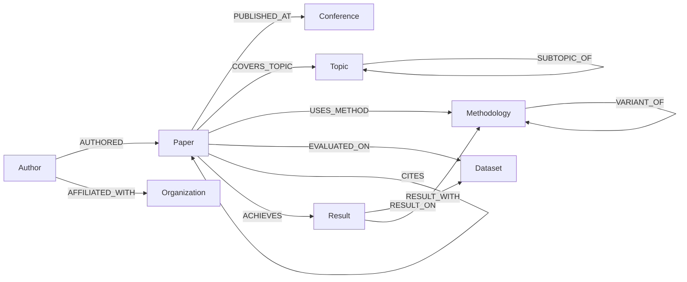

# Knowledge Graph Schema — Autonomous Graph-RAG Agent

> Schema tuân theo mô hình **Labeled Property Graph** (Neo4j).
> Dựa trên `schema_sample.md`, đã điều chỉnh cho phù hợp với project.

---

## 1. Tổng Quan Schema



---

## 2. Node Types (9 loại)

### 2.1 Paper
> Đơn vị trung tâm — một bài báo khoa học.

| Property | Type | Required | Description |
|----------|------|----------|-------------|
| `paper_id` | STRING | ✅ | UUID unique |
| `title` | STRING | ✅ | Tiêu đề paper |
| `abstract` | STRING | ✅ | Tóm tắt |
| `year` | INTEGER | ✅ | Năm xuất bản |
| `doi` | STRING | ❌ | Digital Object Identifier |
| `url` | STRING | ❌ | Link tới paper |
| `pdf_path` | STRING | ❌ | Đường dẫn file PDF |
| `keywords` | LIST\<STRING\> | ❌ | Từ khóa |
| `citation_count` | INTEGER | ❌ | Số lần được trích dẫn |
| `created_at` | DATETIME | ✅ | Thời điểm thêm vào KG |

### 2.2 Author
> Tác giả / đồng tác giả paper.

| Property | Type | Required | Description |
|----------|------|----------|-------------|
| `author_id` | STRING | ✅ | UUID unique |
| `name` | STRING | ✅ | Tên canonical |
| `aliases` | LIST\<STRING\> | ❌ | Các tên khác (cho entity resolution) |
| `email` | STRING | ❌ | Email |
| `orcid` | STRING | ❌ | ORCID ID |
| `h_index` | INTEGER | ❌ | Chỉ số H-index |

### 2.3 Organization
> Tổ chức, trường ĐH, viện nghiên cứu.

| Property | Type | Required | Description |
|----------|------|----------|-------------|
| `org_id` | STRING | ✅ | UUID |
| `name` | STRING | ✅ | Tên canonical |
| `aliases` | LIST\<STRING\> | ❌ | Tên viết tắt / tên khác |
| `type` | STRING | ❌ | "university" / "company" / "research_lab" |
| `country` | STRING | ❌ | Quốc gia |

### 2.4 Conference (Venue)
> Hội nghị, tạp chí nơi paper xuất bản.

| Property | Type | Required | Description |
|----------|------|----------|-------------|
| `venue_id` | STRING | ✅ | UUID |
| `name` | STRING | ✅ | Tên đầy đủ (VD: "AAAI Conference on AI") |
| `acronym` | STRING | ❌ | Viết tắt (VD: "AAAI", "NeurIPS") |
| `type` | STRING | ✅ | "conference" / "journal" / "workshop" / "preprint" |
| `ranking` | STRING | ❌ | Hạng (A*, A, B, C) |

### 2.5 Topic
> Chủ đề / lĩnh vực nghiên cứu. Hỗ trợ hierarchy.

| Property | Type | Required | Description |
|----------|------|----------|-------------|
| `topic_id` | STRING | ✅ | UUID |
| `name` | STRING | ✅ | Tên topic canonical |
| `aliases` | LIST\<STRING\> | ❌ | VD: ["NLP", "natural language processing"] |
| `description` | STRING | ❌ | Mô tả ngắn |
| `level` | INTEGER | ❌ | Hierarchy (0=root, 1=high-level, 2+=specific) |

### 2.6 Methodology
> Phương pháp, mô hình, thuật toán.

| Property | Type | Required | Description |
|----------|------|----------|-------------|
| `method_id` | STRING | ✅ | UUID |
| `name` | STRING | ✅ | Tên canonical |
| `aliases` | LIST\<STRING\> | ❌ | VD: ["GPT-4", "GPT-4 model", "OpenAI GPT-4"] |
| `type` | STRING | ❌ | "model" / "algorithm" / "framework" / "technique" |
| `description` | STRING | ❌ | Mô tả ngắn |

### 2.7 Dataset
> Tập dữ liệu dùng để đánh giá.

| Property | Type | Required | Description |
|----------|------|----------|-------------|
| `dataset_id` | STRING | ✅ | UUID |
| `name` | STRING | ✅ | Tên canonical |
| `aliases` | LIST\<STRING\> | ❌ | Tên khác |
| `domain` | STRING | ❌ | Lĩnh vực: "cv", "nlp", "audio"... |
| `size` | STRING | ❌ | VD: "1M images" |

### 2.8 Result
> Kết quả metric cụ thể đạt được.

| Property | Type | Required | Description |
|----------|------|----------|-------------|
| `result_id` | STRING | ✅ | UUID |
| `metric_name` | STRING | ✅ | "Accuracy", "F1-Score", "BLEU"... |
| `value` | FLOAT | ✅ | Giá trị đạt được |
| `unit` | STRING | ❌ | "%", "ms"... |
| `is_sota` | BOOLEAN | ❌ | Có phải SOTA không |
| `context` | STRING | ❌ | VD: "on ImageNet validation set" |

### 2.9 Chunk (Supplementary — Vector Search)
> Text chunk bổ trợ cho semantic search. **KHÔNG thay thế Entity/Relation extraction.**

| Property | Type | Required | Description |
|----------|------|----------|-------------|
| `chunk_id` | STRING | ✅ | UUID |
| `content` | STRING | ✅ | Nội dung text |
| `section` | STRING | ❌ | Section name |
| `page_number` | INTEGER | ❌ | Số trang |
| `embedding` | LIST\<FLOAT\> | ✅ | Vector embedding |

---

## 3. Relationship Types

### Core Relationships

| Relationship | From → To | Properties | Description |
|-------------|-----------|------------|-------------|
| `AUTHORED` | Author → Paper | `role`, `position` | Tác giả viết paper |
| `AFFILIATED_WITH` | Author → Organization | `current: BOOLEAN` | Tác giả thuộc tổ chức |
| `PUBLISHED_AT` | Paper → Conference | `type` ("oral"/"poster") | Paper xuất bản tại venue |
| `COVERS_TOPIC` | Paper → Topic | `relevance: FLOAT` | Paper thuộc chủ đề |
| `USES_METHOD` | Paper → Methodology | `role` ("proposed"/"baseline"/"component") | Paper sử dụng method |
| `EVALUATED_ON` | Paper → Dataset | `split` ("train"/"test"/"val") | Đánh giá trên dataset |
| `CITES` | Paper → Paper | `context` | Trích dẫn paper khác |
| `ACHIEVES` | Paper → Result | — | Đạt được kết quả |

### Hierarchical Relationships

| Relationship | From → To | Description |
|-------------|-----------|-------------|
| `SUBTOPIC_OF` | Topic → Topic | Cha-con giữa topics |
| `VARIANT_OF` | Methodology → Methodology | Method là biến thể |

### Supplementary Relationships

| Relationship | From → To | Description |
|-------------|-----------|-------------|
| `HAS_CHUNK` | Paper → Chunk | Paper chứa text chunk |
| `RESULT_ON` | Result → Dataset | Kết quả trên dataset cụ thể |
| `RESULT_WITH` | Result → Methodology | Kết quả bằng method cụ thể |

---

## 4. Entity Resolution Rules

| Entity Type | Matching Strategy | Threshold |
|------------|-------------------|-----------|
| **Author** | Tên + affiliation + co-authors overlap | Fuzzy > 0.85 |
| **Organization** | Tên + acronym + country | Fuzzy > 0.9 |
| **Conference** | Acronym exact match + name similarity | Exact OR fuzzy > 0.9 |
| **Topic** | Embedding similarity + alias lookup | Cosine > 0.85 |
| **Methodology** | Name similarity + description | Fuzzy > 0.8 OR cosine > 0.9 |
| **Dataset** | Name exact/fuzzy match + domain | Fuzzy > 0.9 |

### Alias Management
```python
entity_input = "GPT-4 model"
resolved = resolve_entity(entity_input, type="Methodology")
# → Methodology(name="GPT-4", aliases=["GPT-4 model", "OpenAI GPT-4", "GPT4"])
```

### Conflict Resolution Priority
1. **Exact match** trên canonical name → merge
2. **Alias match** → merge
3. **Embedding similarity** → candidate merge
4. **LLM judgment** → final decision

---

## 5. Neo4j Initialization Script

```cypher
-- Constraints
CREATE CONSTRAINT paper_id_unique IF NOT EXISTS FOR (p:Paper) REQUIRE p.paper_id IS UNIQUE;
CREATE CONSTRAINT author_id_unique IF NOT EXISTS FOR (a:Author) REQUIRE a.author_id IS UNIQUE;
CREATE CONSTRAINT org_id_unique IF NOT EXISTS FOR (o:Organization) REQUIRE o.org_id IS UNIQUE;
CREATE CONSTRAINT venue_id_unique IF NOT EXISTS FOR (v:Conference) REQUIRE v.venue_id IS UNIQUE;
CREATE CONSTRAINT topic_id_unique IF NOT EXISTS FOR (t:Topic) REQUIRE t.topic_id IS UNIQUE;
CREATE CONSTRAINT method_id_unique IF NOT EXISTS FOR (m:Methodology) REQUIRE m.method_id IS UNIQUE;
CREATE CONSTRAINT dataset_id_unique IF NOT EXISTS FOR (d:Dataset) REQUIRE d.dataset_id IS UNIQUE;
CREATE CONSTRAINT result_id_unique IF NOT EXISTS FOR (r:Result) REQUIRE r.result_id IS UNIQUE;

-- Indexes
CREATE INDEX paper_title_idx IF NOT EXISTS FOR (p:Paper) ON (p.title);
CREATE INDEX paper_year_idx IF NOT EXISTS FOR (p:Paper) ON (p.year);
CREATE INDEX author_name_idx IF NOT EXISTS FOR (a:Author) ON (a.name);
CREATE INDEX venue_acronym_idx IF NOT EXISTS FOR (v:Conference) ON (v.acronym);
CREATE INDEX topic_name_idx IF NOT EXISTS FOR (t:Topic) ON (t.name);
CREATE INDEX method_name_idx IF NOT EXISTS FOR (m:Methodology) ON (m.name);
CREATE INDEX dataset_name_idx IF NOT EXISTS FOR (d:Dataset) ON (d.name);

-- Full-text search
CREATE FULLTEXT INDEX paper_fulltext_idx IF NOT EXISTS FOR (p:Paper) ON EACH [p.title, p.abstract];
```

---

## 6. Ví Dụ Cypher Queries

```cypher
-- Tìm papers theo tác giả
MATCH (a:Author {name: "Vaswani"})-[:AUTHORED]->(p:Paper)
RETURN p.title, p.year ORDER BY p.year DESC

-- So sánh 2 papers (methods + results)
MATCH (p1:Paper {title: "Paper A"})-[:USES_METHOD]->(m1:Methodology)
MATCH (p2:Paper {title: "Paper B"})-[:USES_METHOD]->(m2:Methodology)
MATCH (p1)-[:ACHIEVES]->(r1:Result)
MATCH (p2)-[:ACHIEVES]->(r2:Result)
RETURN p1.title, collect(DISTINCT m1.name),
       p2.title, collect(DISTINCT m2.name),
       collect(DISTINCT {metric: r1.metric_name, value: r1.value})

-- Papers liên quan (multi-hop)
MATCH (p:Paper {title: "Target"})-[:COVERS_TOPIC]->(t:Topic)<-[:COVERS_TOPIC]-(related:Paper)
MATCH (p)-[:USES_METHOD]->(m:Methodology)<-[:USES_METHOD]-(related)
WHERE p <> related
RETURN related.title, collect(DISTINCT t.name), collect(DISTINCT m.name)

-- Citation network
MATCH (cited:Paper)<-[:CITES]-(citing:Paper)
RETURN cited.title, COUNT(citing) AS citations ORDER BY citations DESC LIMIT 10
```
