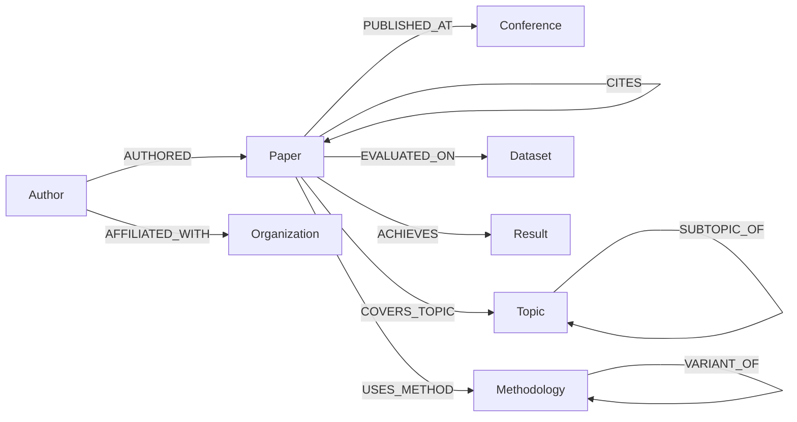

# Knowledge Graph Schema — Academic Paper Knowledge Agent

> Tài liệu này định nghĩa schema cho Knowledge Graph phục vụ hệ thống chatbot tìm kiếm và phân tích papers.
> Schema tuân theo mô hình **Labeled Property Graph** (Neo4j).

---

## 1. Tổng quan Schema



---

## 2. Node Types (Entity Labels)

### 2.1 Paper
> Đơn vị trung tâm của Knowledge Graph — một bài báo khoa học.

| Property | Type | Required | Description |
|----------|------|----------|-------------|
| `paper_id` | STRING | ✅ | Unique identifier (UUID hoặc DOI-based) |
| `title` | STRING | ✅ | Tiêu đề paper |
| `abstract` | STRING | ✅ | Tóm tắt paper |
| `year` | INTEGER | ✅ | Năm xuất bản |
| `doi` | STRING | ❌ | Digital Object Identifier |
| `arxiv_id` | STRING | ❌ | ArXiv ID nếu có |
| `url` | STRING | ❌ | Link tới paper |
| `pdf_path` | STRING | ❌ | Đường dẫn local tới file PDF |
| `full_text` | STRING | ❌ | Nội dung toàn bộ paper (cho deep search) |
| `keywords` | LIST\<STRING\> | ❌ | Từ khóa do tác giả cung cấp |
| `citation_count` | INTEGER | ❌ | Số lần được trích dẫn |
| `embedding` | LIST\<FLOAT\> | ❌ | Vector embedding của abstract (cho vector search) |
| `created_at` | DATETIME | ✅ | Thời điểm được thêm vào KG |
| `updated_at` | DATETIME | ✅ | Lần cập nhật cuối |

**Constraints:**
```cypher
CREATE CONSTRAINT paper_id_unique IF NOT EXISTS
FOR (p:Paper) REQUIRE p.paper_id IS UNIQUE;

CREATE INDEX paper_title_idx IF NOT EXISTS
FOR (p:Paper) ON (p.title);

CREATE INDEX paper_year_idx IF NOT EXISTS
FOR (p:Paper) ON (p.year);
```

---

### 2.2 Author
> Người viết/đồng tác giả paper.

| Property | Type | Required | Description |
|----------|------|----------|-------------|
| `author_id` | STRING | ✅ | Unique identifier |
| `name` | STRING | ✅ | Tên đầy đủ (canonical form) |
| `aliases` | LIST\<STRING\> | ❌ | Các tên khác (cho entity resolution) |
| `email` | STRING | ❌ | Email liên hệ |
| `orcid` | STRING | ❌ | ORCID ID |
| `google_scholar_id` | STRING | ❌ | Google Scholar profile ID |
| `h_index` | INTEGER | ❌ | Chỉ số H-index |
| `is_lab_member` | BOOLEAN | ✅ | Có phải thành viên lab không |
| `embedding` | LIST\<FLOAT\> | ❌ | Embedding cho similarity search |

**Constraints:**
```cypher
CREATE CONSTRAINT author_id_unique IF NOT EXISTS
FOR (a:Author) REQUIRE a.author_id IS UNIQUE;

CREATE INDEX author_name_idx IF NOT EXISTS
FOR (a:Author) ON (a.name);
```

---

### 2.3 Organization
> Tổ chức, trường đại học, viện nghiên cứu.

| Property | Type | Required | Description |
|----------|------|----------|-------------|
| `org_id` | STRING | ✅ | Unique identifier |
| `name` | STRING | ✅ | Tên tổ chức (canonical) |
| `aliases` | LIST\<STRING\> | ❌ | Tên viết tắt, tên khác |
| `type` | STRING | ❌ | "university" / "company" / "research_lab" |
| `country` | STRING | ❌ | Quốc gia |
| `url` | STRING | ❌ | Website |

**Constraints:**
```cypher
CREATE CONSTRAINT org_id_unique IF NOT EXISTS
FOR (o:Organization) REQUIRE o.org_id IS UNIQUE;
```

---

### 2.4 Conference (Venue)
> Hội nghị, tạp chí, nơi paper được xuất bản.

| Property | Type | Required | Description |
|----------|------|----------|-------------|
| `venue_id` | STRING | ✅ | Unique identifier |
| `name` | STRING | ✅ | Tên đầy đủ (e.g., "AAAI Conference on Artificial Intelligence") |
| `acronym` | STRING | ❌ | Tên viết tắt (e.g., "AAAI") |
| `type` | STRING | ✅ | "conference" / "journal" / "workshop" / "preprint" |
| `year` | INTEGER | ❌ | Năm tổ chức (cho conference instances) |
| `ranking` | STRING | ❌ | Hạng (A*, A, B, C) |
| `url` | STRING | ❌ | Website |

**Constraints:**
```cypher
CREATE CONSTRAINT venue_id_unique IF NOT EXISTS
FOR (v:Conference) REQUIRE v.venue_id IS UNIQUE;

CREATE INDEX venue_acronym_idx IF NOT EXISTS
FOR (v:Conference) ON (v.acronym);
```

---

### 2.5 Topic
> Chủ đề, lĩnh vực nghiên cứu. Hỗ trợ hierarchical structure.

| Property | Type | Required | Description |
|----------|------|----------|-------------|
| `topic_id` | STRING | ✅ | Unique identifier |
| `name` | STRING | ✅ | Tên topic (canonical, lowercase) |
| `aliases` | LIST\<STRING\> | ❌ | Synonyms (e.g., ["NLP", "natural language processing"]) |
| `description` | STRING | ❌ | Mô tả ngắn |
| `level` | INTEGER | ❌ | Cấp độ hierarchy (0 = root, 1 = high-level, 2+ = specific) |
| `embedding` | LIST\<FLOAT\> | ❌ | Embedding cho similarity matching |

**Constraints:**
```cypher
CREATE CONSTRAINT topic_id_unique IF NOT EXISTS
FOR (t:Topic) REQUIRE t.topic_id IS UNIQUE;

CREATE INDEX topic_name_idx IF NOT EXISTS
FOR (t:Topic) ON (t.name);
```

---

### 2.6 Methodology
> Phương pháp, mô hình, thuật toán được sử dụng trong paper.

| Property | Type | Required | Description |
|----------|------|----------|-------------|
| `method_id` | STRING | ✅ | Unique identifier |
| `name` | STRING | ✅ | Tên phương pháp (canonical) |
| `aliases` | LIST\<STRING\> | ❌ | Các tên khác (e.g., ["GPT-4", "GPT-4 model", "OpenAI GPT-4"]) |
| `type` | STRING | ❌ | "model" / "algorithm" / "framework" / "technique" |
| `description` | STRING | ❌ | Mô tả ngắn |

**Example entity resolution:**
```
Input:  "GPT-4", "GPT-4 model", "OpenAI's GPT-4"
Output: Methodology { name: "GPT-4", aliases: ["GPT-4 model", "OpenAI's GPT-4"] }
```

**Constraints:**
```cypher
CREATE CONSTRAINT method_id_unique IF NOT EXISTS
FOR (m:Methodology) REQUIRE m.method_id IS UNIQUE;
```

---

### 2.7 Dataset
> Bộ dữ liệu được sử dụng để đánh giá trong paper.

| Property | Type | Required | Description |
|----------|------|----------|-------------|
| `dataset_id` | STRING | ✅ | Unique identifier |
| `name` | STRING | ✅ | Tên dataset (canonical) |
| `aliases` | LIST\<STRING\> | ❌ | Tên khác |
| `domain` | STRING | ❌ | Lĩnh vực (e.g., "computer_vision", "nlp") |
| `size` | STRING | ❌ | Kích thước (e.g., "1M images") |
| `url` | STRING | ❌ | Link tải |

**Constraints:**
```cypher
CREATE CONSTRAINT dataset_id_unique IF NOT EXISTS
FOR (d:Dataset) REQUIRE d.dataset_id IS UNIQUE;
```

---

### 2.8 Result
> Kết quả metric cụ thể đạt được trong paper.

| Property | Type | Required | Description |
|----------|------|----------|-------------|
| `result_id` | STRING | ✅ | Unique identifier |
| `metric_name` | STRING | ✅ | Tên metric (e.g., "Accuracy", "F1-Score", "BLEU") |
| `value` | FLOAT | ✅ | Giá trị đạt được |
| `unit` | STRING | ❌ | Đơn vị (e.g., "%", "ms") |
| `is_sota` | BOOLEAN | ❌ | Có phải state-of-the-art tại thời điểm publish không |
| `context` | STRING | ❌ | Bối cảnh (e.g., "on ImageNet validation set") |

**Constraints:**
```cypher
CREATE CONSTRAINT result_id_unique IF NOT EXISTS
FOR (r:Result) REQUIRE r.result_id IS UNIQUE;
```

---

### 2.9 Chunk (Supplementary)
> Text chunk từ paper, dùng cho vector search. Không thuộc core KG nhưng liên kết vào.

| Property | Type | Required | Description |
|----------|------|----------|-------------|
| `chunk_id` | STRING | ✅ | Unique identifier |
| `content` | STRING | ✅ | Nội dung text |
| `section` | STRING | ❌ | Section name (Abstract, Introduction, ...) |
| `page_number` | INTEGER | ❌ | Số trang trong PDF |
| `token_count` | INTEGER | ❌ | Số tokens |
| `embedding` | LIST\<FLOAT\> | ✅ | Vector embedding |

**Constraints:**
```cypher
CREATE CONSTRAINT chunk_id_unique IF NOT EXISTS
FOR (c:Chunk) REQUIRE c.chunk_id IS UNIQUE;

// Vector index cho semantic search
CREATE VECTOR INDEX chunk_embedding_idx IF NOT EXISTS
FOR (c:Chunk) ON (c.embedding)
OPTIONS {indexConfig: {
  `vector.dimensions`: 1536,
  `vector.similarity_function`: 'cosine'
}};
```

---

## 3. Relationship Types (Edge Labels)

### 3.1 Core Relationships

| Relationship | From → To | Properties | Description |
|-------------|-----------|------------|-------------|
| `AUTHORED` | Author → Paper | `role: STRING` ("first_author" / "co_author" / "corresponding"), `position: INTEGER` | Tác giả viết paper |
| `AFFILIATED_WITH` | Author → Organization | `from_year: INTEGER`, `to_year: INTEGER`, `current: BOOLEAN` | Tác giả thuộc tổ chức |
| `PUBLISHED_AT` | Paper → Conference | `type: STRING` ("oral" / "poster" / "workshop") | Paper được xuất bản tại venue |
| `COVERS_TOPIC` | Paper → Topic | `relevance: FLOAT` (0.0-1.0) | Paper thuộc chủ đề |
| `USES_METHOD` | Paper → Methodology | `role: STRING` ("proposed" / "baseline" / "component") | Paper sử dụng phương pháp |
| `EVALUATED_ON` | Paper → Dataset | `split: STRING` ("train" / "test" / "validation") | Paper đánh giá trên dataset |
| `CITES` | Paper → Paper | `context: STRING` | Paper trích dẫn paper khác |
| `ACHIEVES` | Paper → Result | — | Paper đạt được kết quả |

### 3.2 Hierarchical Relationships

| Relationship | From → To | Properties | Description |
|-------------|-----------|------------|-------------|
| `SUBTOPIC_OF` | Topic → Topic | — | Quan hệ cha-con giữa topics |
| `VARIANT_OF` | Methodology → Methodology | `modification: STRING` | Phương pháp là biến thể của phương pháp khác |

### 3.3 Supplementary Relationships

| Relationship | From → To | Properties | Description |
|-------------|-----------|------------|-------------|
| `HAS_CHUNK` | Paper → Chunk | `order: INTEGER` | Paper chứa text chunk |
| `RESULT_ON` | Result → Dataset | — | Kết quả đạt trên dataset cụ thể |
| `RESULT_WITH` | Result → Methodology | — | Kết quả đạt bằng phương pháp cụ thể |

---

## 4. Ví dụ Cypher Queries

### 4.1 Tìm papers theo tác giả
```cypher
MATCH (a:Author {name: "Nguyen Van A"})-[:AUTHORED]->(p:Paper)
RETURN p.title, p.year, p.abstract
ORDER BY p.year DESC
```

### 4.2 Tìm papers theo chủ đề
```cypher
MATCH (p:Paper)-[:COVERS_TOPIC]->(t:Topic)
WHERE t.name = "natural language processing" OR "NLP" IN t.aliases
RETURN p.title, p.year, p.abstract
ORDER BY p.year DESC
```

### 4.3 Tìm papers theo hội nghị và năm
```cypher
MATCH (p:Paper)-[:PUBLISHED_AT]->(v:Conference)
WHERE v.acronym = "AAAI" AND p.year = 2025
RETURN p.title, p.year
```

### 4.4 So sánh hai papers (methods + results)
```cypher
MATCH (p1:Paper {title: "Paper A"})-[:USES_METHOD]->(m1:Methodology)
MATCH (p2:Paper {title: "Paper B"})-[:USES_METHOD]->(m2:Methodology)
MATCH (p1)-[:ACHIEVES]->(r1:Result)
MATCH (p2)-[:ACHIEVES]->(r2:Result)
RETURN p1.title, collect(DISTINCT m1.name) AS methods_1,
       p2.title, collect(DISTINCT m2.name) AS methods_2,
       collect(DISTINCT {metric: r1.metric_name, value: r1.value}) AS results_1,
       collect(DISTINCT {metric: r2.metric_name, value: r2.value}) AS results_2
```

### 4.5 Tìm papers liên quan (multi-hop)
```cypher
// Papers cùng topic VÀ cùng method
MATCH (p:Paper {title: "Target Paper"})-[:COVERS_TOPIC]->(t:Topic)<-[:COVERS_TOPIC]-(related:Paper)
MATCH (p)-[:USES_METHOD]->(m:Methodology)<-[:USES_METHOD]-(related)
WHERE p <> related
RETURN related.title, related.year,
       collect(DISTINCT t.name) AS shared_topics,
       collect(DISTINCT m.name) AS shared_methods
ORDER BY SIZE(collect(DISTINCT t.name)) + SIZE(collect(DISTINCT m.name)) DESC
LIMIT 10
```

### 4.6 Citation network — papers ảnh hưởng nhất
```cypher
MATCH (cited:Paper)<-[:CITES]-(citing:Paper)
RETURN cited.title, cited.year, COUNT(citing) AS citation_count
ORDER BY citation_count DESC
LIMIT 10
```

### 4.7 Researcher collaboration network
```cypher
MATCH (a1:Author)-[:AUTHORED]->(p:Paper)<-[:AUTHORED]-(a2:Author)
WHERE a1 <> a2
RETURN a1.name, a2.name, COUNT(p) AS collaborations
ORDER BY collaborations DESC
```

### 4.8 Vector search — similar papers
```cypher
// Sử dụng Neo4j native vector search
CALL db.index.vector.queryNodes('chunk_embedding_idx', 5, $queryEmbedding)
YIELD node AS chunk, score
MATCH (p:Paper)-[:HAS_CHUNK]->(chunk)
RETURN p.title, chunk.section, chunk.content, score
ORDER BY score DESC
```

---

## 5. Entity Resolution Rules

> [!IMPORTANT]
> Entity Resolution là bước **critical** để đảm bảo chất lượng Knowledge Graph.

### 5.1 Rules cho từng Entity Type

| Entity Type | Matching Strategy | Threshold |
|------------|-------------------|-----------|
| **Author** | Tên + affiliation + co-authors overlap | Fuzzy match > 0.85 |
| **Organization** | Tên + acronym + country | Fuzzy match > 0.9 |
| **Conference** | Acronym exact match + name similarity | Exact acronym OR fuzzy > 0.9 |
| **Topic** | Embedding similarity + alias lookup | Cosine > 0.85 |
| **Methodology** | Name similarity + description embedding | Fuzzy > 0.8 OR cosine > 0.9 |
| **Dataset** | Name exact/fuzzy match + domain | Fuzzy > 0.9 |

### 5.2 Alias Management
Mỗi entity có field `aliases` chứa tất cả surface forms đã gặp:
```python
# Ví dụ entity resolution pipeline
entity_input = "GPT-4 model"
canonical = resolve_entity(entity_input, type="Methodology")
# → Methodology(name="GPT-4", aliases=["GPT-4 model", "OpenAI GPT-4", "GPT4"])
```

### 5.3 Conflict Resolution Priority
1. **Exact match** trên canonical name → merge
2. **Alias match** → merge
3. **Embedding similarity** trên (name + description) → candidate merge
4. **LLM judgment** cho ambiguous cases → human review flag

---

## 6. Neo4j Initialization Script

```cypher
// ============================================
// CONSTRAINTS (enforce uniqueness)
// ============================================
CREATE CONSTRAINT paper_id_unique IF NOT EXISTS FOR (p:Paper) REQUIRE p.paper_id IS UNIQUE;
CREATE CONSTRAINT author_id_unique IF NOT EXISTS FOR (a:Author) REQUIRE a.author_id IS UNIQUE;
CREATE CONSTRAINT org_id_unique IF NOT EXISTS FOR (o:Organization) REQUIRE o.org_id IS UNIQUE;
CREATE CONSTRAINT venue_id_unique IF NOT EXISTS FOR (v:Conference) REQUIRE v.venue_id IS UNIQUE;
CREATE CONSTRAINT topic_id_unique IF NOT EXISTS FOR (t:Topic) REQUIRE t.topic_id IS UNIQUE;
CREATE CONSTRAINT method_id_unique IF NOT EXISTS FOR (m:Methodology) REQUIRE m.method_id IS UNIQUE;
CREATE CONSTRAINT dataset_id_unique IF NOT EXISTS FOR (d:Dataset) REQUIRE d.dataset_id IS UNIQUE;
CREATE CONSTRAINT result_id_unique IF NOT EXISTS FOR (r:Result) REQUIRE r.result_id IS UNIQUE;
CREATE CONSTRAINT chunk_id_unique IF NOT EXISTS FOR (c:Chunk) REQUIRE c.chunk_id IS UNIQUE;

// ============================================
// INDEXES (optimize query performance)
// ============================================
CREATE INDEX paper_title_idx IF NOT EXISTS FOR (p:Paper) ON (p.title);
CREATE INDEX paper_year_idx IF NOT EXISTS FOR (p:Paper) ON (p.year);
CREATE INDEX author_name_idx IF NOT EXISTS FOR (a:Author) ON (a.name);
CREATE INDEX venue_acronym_idx IF NOT EXISTS FOR (v:Conference) ON (v.acronym);
CREATE INDEX topic_name_idx IF NOT EXISTS FOR (t:Topic) ON (t.name);
CREATE INDEX method_name_idx IF NOT EXISTS FOR (m:Methodology) ON (m.name);
CREATE INDEX dataset_name_idx IF NOT EXISTS FOR (d:Dataset) ON (d.name);

// ============================================
// VECTOR INDEXES (for semantic search)
// ============================================
CREATE VECTOR INDEX paper_embedding_idx IF NOT EXISTS
FOR (p:Paper) ON (p.embedding)
OPTIONS {indexConfig: {
  `vector.dimensions`: 1536,
  `vector.similarity_function`: 'cosine'
}};

CREATE VECTOR INDEX chunk_embedding_idx IF NOT EXISTS
FOR (c:Chunk) ON (c.embedding)
OPTIONS {indexConfig: {
  `vector.dimensions`: 1536,
  `vector.similarity_function`: 'cosine'
}};

CREATE VECTOR INDEX topic_embedding_idx IF NOT EXISTS
FOR (t:Topic) ON (t.embedding)
OPTIONS {indexConfig: {
  `vector.dimensions`: 1536,
  `vector.similarity_function`: 'cosine'
}};

// ============================================
// FULL-TEXT INDEXES (for keyword search)
// ============================================
CREATE FULLTEXT INDEX paper_fulltext_idx IF NOT EXISTS
FOR (p:Paper) ON EACH [p.title, p.abstract];

CREATE FULLTEXT INDEX author_fulltext_idx IF NOT EXISTS
FOR (a:Author) ON EACH [a.name];
```

---

## 7. Schema Evolution Guidelines

> [!NOTE]
> Schema sẽ cần evolve theo thời gian. Tuân theo các nguyên tắc sau:

1. **Additive only:** Chỉ thêm node types, relationship types, properties. Không xóa.
2. **Backward compatible:** Properties mới phải optional (không required).
3. **Version tracking:** Ghi lại version schema trong Neo4j metadata.
4. **Migration scripts:** Mỗi thay đổi schema cần Cypher migration script.

```cypher
// Ví dụ migration: thêm field mới
MATCH (p:Paper) WHERE p.language IS NULL
SET p.language = "en";  // default value cho existing nodes
```
